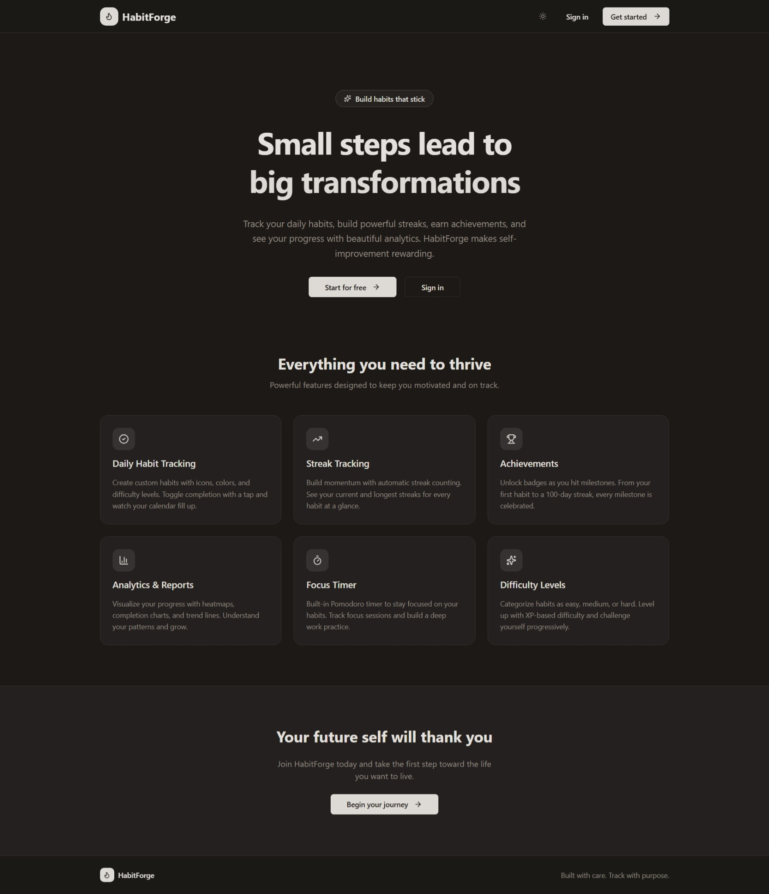
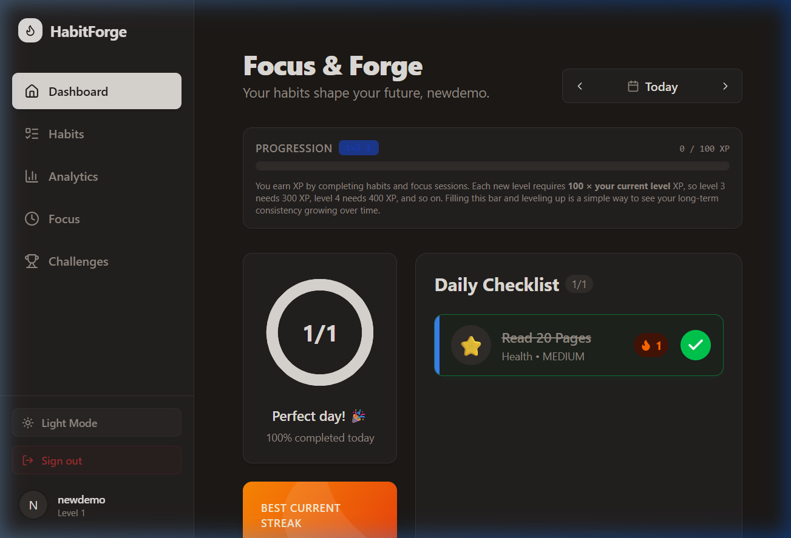
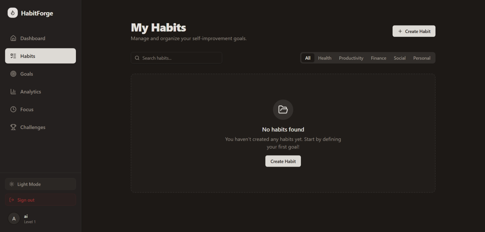
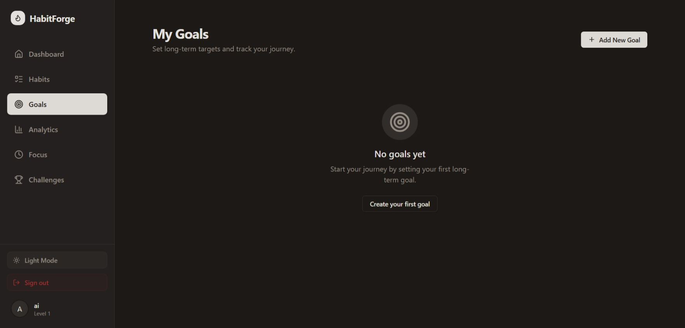
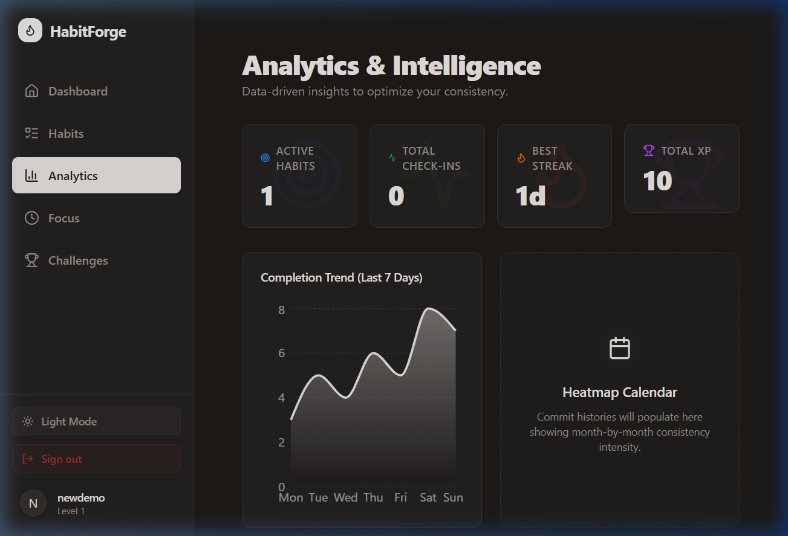
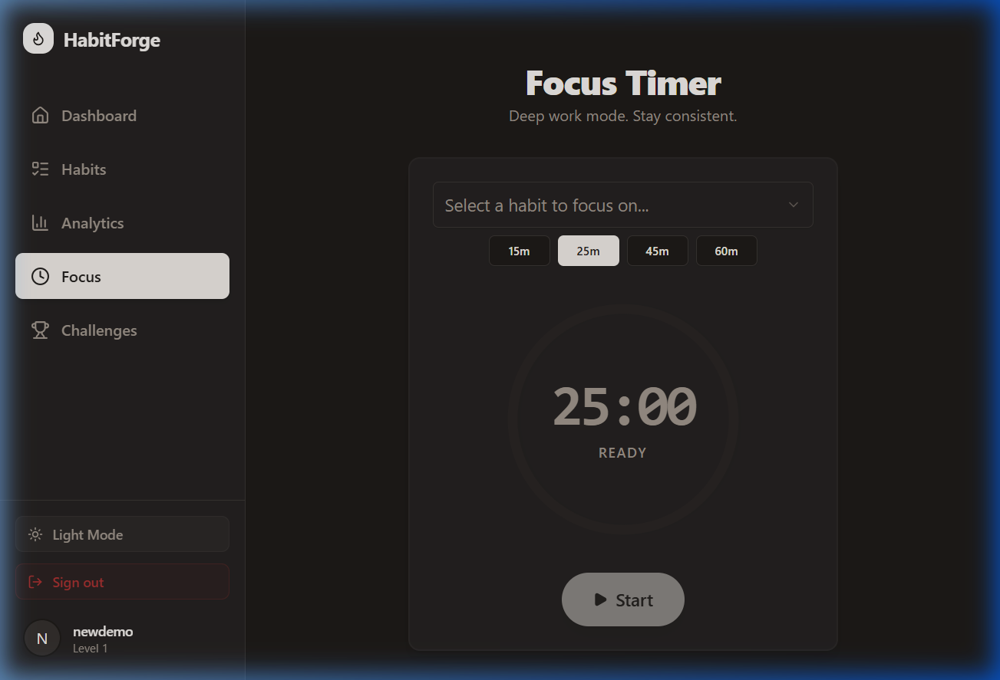
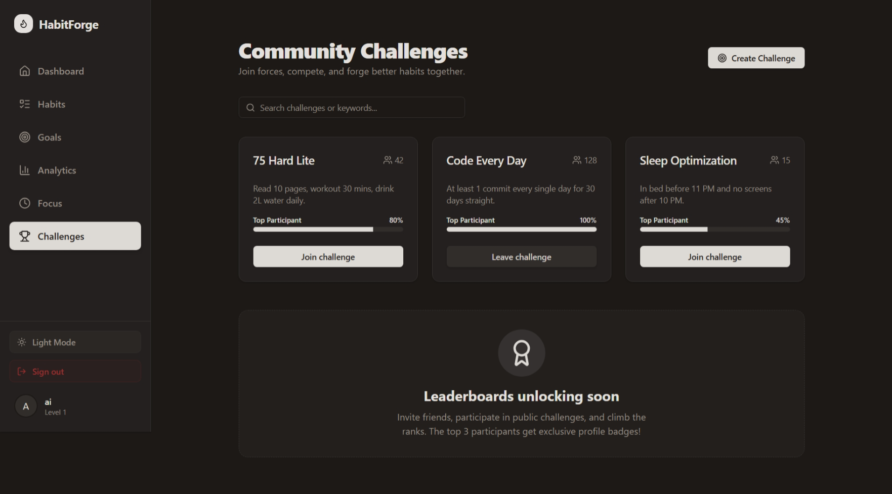
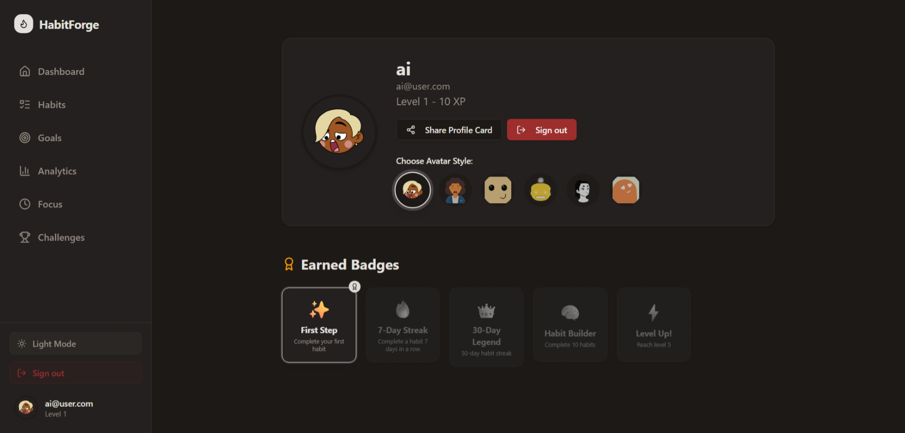

# HabitForge Frontend

## Project Title
HabitForge (Frontend)

## Project Description
HabitForge is a modern web application designed to help users build better habits, track their daily progress, and forge their future. The frontend is built with React and Vite, featuring a sleek, responsive UI with light/dark modes, daily habit checklists, streak tracking, and customizable difficulty levels. It is integrated with a backend API for robust data persistence.

## Features
- **Daily Habit Tracking:** Create custom habits with icons, colors, and difficulty levels.
- **Long-term Goals:** Set ambitious targets and track your journey with visual progress bars.
- **Advanced Analytics:** Visualize progress with heatmaps and completion trends. Gain insights into your habits and optimize your routine.
- **Focus Timer:** Built-in Pomodoro timer for deep work sessions.
- **Streak & XP Progression:** Build momentum with streak counting and level up using XP-based progression.
- **Theme Support:** Seamless switching between dark and light modes.
- **Offline/Demo Mode:** Seamlessly use a robust local data store if the backend or Supabase is unavailable.

## Tech Stack Used
- **Logic:** React 19 (Vite)
- **Styling:** Tailwind CSS v4, Tailwind Animate, Framer Motion
- **UI Components:** shadcn/ui (Radix UI), Lucide React (Icons)
- **Data Management:** React Query (Fetching/Caching), Supabase JS Client, Axios
- **Routing:** React Router DOM v7
- **Notifications:** Sonner

## Installation Steps
1. Navigate to the frontend directory: `cd frontend`
2. Install dependencies: `npm install`
3. Start the development server: `npm run dev`
4. Build for production: `npm run build`

## Deployment Link
[Frontend Live Demo](https://habitforge-f.netlify.app)

## Backend API Link
The frontend connects to the backend API hosted at:
[Backend API Service](https://backend-service-5igw.onrender.com)
(For local development, ensure the backend is running on `http://localhost:3001` or as configured in `.env`)

## Login Credentials (if applicable)
For demonstration purposes, users can click "Demo Account" or "Get Started" without setting up Supabase to instantly access a local Demo Mode account. 
To log into the initial demo experience:
- **Email:** `demo@habitforge.app`
- **Password:** (Any 6+ character password)

## Screenshots

### Landing Page

### Dashboard

### Habits

### Goals

### Analytics

### Focus Timer

### Challenges

### Profile

## Video Walkthrough Link
<!--  -->

